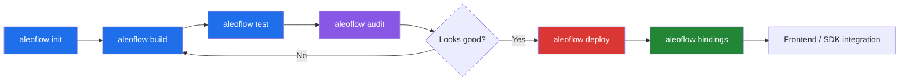
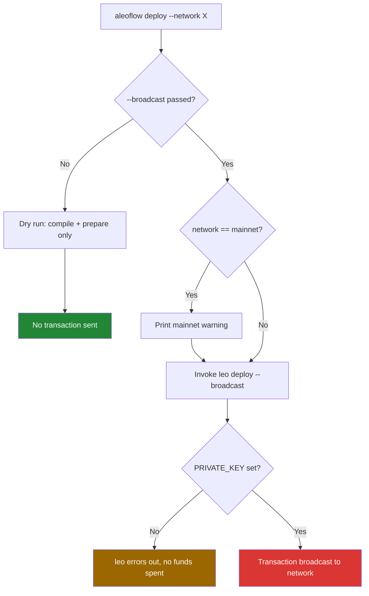

# AleoFlow

A single-binary developer CLI that wraps the Aleo toolchain (`leo`, and
eventually `snarkOS`) into one consistent workflow: scaffold, build, test,
audit, deploy, and generate TypeScript bindings for Aleo programs.

Built for the **Aleo Hackathon 2026 — Infrastructure & Developer Tools
track**.

AleoFlow does not reimplement Leo's compiler or the Aleo network client.
It wraps the official `leo` CLI and adds the parts that are missing from
day-to-day developer workflow: project scaffolding with real templates, a
lightweight privacy linter, and TypeScript client stub generation from a
compiled program's ABI.

## Why

Aleo's official tooling (`leo`, `snarkOS`) is powerful but fragmented —
getting a new privacy-preserving program from idea to deployed contract
means juggling several separate tools and remembering their exact flags.
AleoFlow collapses that into one binary with one consistent interface,
similar in spirit to tools like `create-react-app` or `cargo` itself:
opinionated defaults, real templates, and no reinvention of the
underlying compiler or network logic.

## Prerequisites

- **Rust** (stable toolchain) — <https://rustup.rs>
- **Leo** — the Aleo compiler AleoFlow wraps:
  ```
  cargo install cargo-binstall
  cargo binstall leo-lang
  ```
  Verify with `leo --version`.
- **snarkOS** — only required for the `devnet` command (local test
  network). Install via `leo devnet --install` the first time you run
  `aleoflow devnet`.

## Install

### 1. Pre-built Binaries (Simplest option for quick trial)

If you don't have Rust installed, the easiest way to try AleoFlow is by downloading a pre-built binary directly from the [GitHub Releases](https://github.com/DiverseXL/aleoflow/releases/latest) page.

Select the binary corresponding to your platform:
- **Linux**: `aleoflow-linux-x86_64`
- **macOS (Apple Silicon)**: `aleoflow-macos-arm64`
- **Windows**: `aleoflow-windows-x86_64.exe`

---

If you prefer to build from source or contribute, the other installation options remain available:

### 2. From crates.io

```
cargo install aleoflow
```

### 3. From Source

```
git clone https://github.com/DiverseXL/aleoflow
cd aleoflow
cargo install --path .
```

Or build a release binary and run it directly:

```
cargo build --release
./target/release/aleoflow --help
```

The binary is fully portable — project templates are embedded into it at
compile time, so it works from any directory without needing the
`templates/` folder alongside it.

## Quick Start

```
aleoflow init my-app --template payment
cd my-app
aleoflow build
aleoflow test
aleoflow audit .
```

## Workflow



Each stage wraps a real underlying tool rather than reinventing it —
`build`/`test`/`deploy`/`devnet` shell out to the official `leo` binary,
`audit` and `bindings` are AleoFlow-native additions that fill gaps the
official toolchain doesn't cover.

### Deploy safety flow



This mirrors `leo deploy`'s own default behavior (dry-run unless
`--broadcast` is explicit) rather than layering a separate confirmation
system on top of it.

## Commands

### `aleoflow init <name> --template <template>`

Scaffolds a new Aleo project from a built-in template. Templates:

- `payment` — basic private transfer
- `defi` — deposit / withdraw pair
- `ai-agent` — simple agent state record + inference stub
- `gamefi` — player state / score submission record

Project names containing hyphens are automatically sanitized to
underscores for the generated Aleo program ID (Aleo program identifiers
cannot contain hyphens), while the folder name stays exactly as typed.

```
aleoflow init my-voting-app --template defi
```

### `aleoflow build [--path <path>] [--json-output[=<file>]]`

Wraps `leo build`. Compiles the Leo program at `path` (or the current
directory if omitted) into Aleo instructions.

```
aleoflow build --path my-app
```

### `aleoflow test [--path <path>] [--json-output[=<file>]]`

Wraps `leo test`.

```
aleoflow test --path my-app
```

### `aleoflow audit <path>`

A heuristic static linter for Leo source files — **not** a formal verifier. Checks include:

1. **Sensitive-named record fields declared public**: Detects record fields with sensitive names (e.g., `password`, `secret`, `private_key`, `ssn`) declared as public.
2. **On-chain leaks via mapping writes**: Detects `Mapping::set` calls that write sensitive-named values to public on-chain mappings.
3. **The "finalize-leak" check**: A single-hop, shallow data-flow check that catches private record fields (either directly or via a single intermediate `let` binding) being passed into `finalize` or asynchronous function calls. This prevents private record fields from being leaked onto the public on-chain ledger, a documented Aleo security vulnerability (see [Aleo Program Security](https://blog.zksecurity.xyz/posts/aleo-program-security/)) that `leo build` itself does not catch.
   - *Note:* This check is single-hop/shallow and does not track multi-step reassignments, arithmetic transformations, or values passed through helper functions first.
4. **TODO/FIXME comments**: Identifies leftover `TODO` or `FIXME` comments as informational findings.

```
aleoflow audit ./my-app
```

### `aleoflow deploy --path <path> --network <testnet|mainnet|canary> [--broadcast] [--endpoint <url>] [--json-output[=<file>]]`

Wraps `leo deploy`. Runs in **dry-run mode by default** — it compiles and
prepares the deployment but does not broadcast anything unless
`--broadcast` is explicitly passed. This mirrors `leo`'s own safety
default rather than re-implementing a separate confirmation flow.

Deploying to `mainnet` with `--broadcast` prints an explicit warning
before proceeding.

`--endpoint` overrides the target RPC endpoint (useful for pointing at a
local `leo devnet` node instead of the public testnet API, e.g. during
an outage on the public endpoint).

```
# Dry run — safe, does not deploy anything
aleoflow deploy --path my-app --network testnet

# Actually deploy to testnet
aleoflow deploy --path my-app --network testnet --broadcast

# Deploy against a local devnet instead of the public API
aleoflow deploy --path my-app --network testnet --broadcast --endpoint http://localhost:3030
```

Deployment requires a funded account. See **Deploying for real** below.

### `aleoflow devnet [--path <path>] [--network <network>]`

Wraps `leo devnet` to start a local Aleo development network. Requires
snarkOS; if it isn't installed, AleoFlow will tell you to run
`leo devnet --snarkos <path> --install` on the first run (snarkOS is not bundled
and must be built/installed separately).

```
aleoflow devnet --path my-app
```

### `aleoflow bindings <path> [--output <file>]`

Generates TypeScript client stubs from a compiled program's ABI
(`build/<program_id>/abi.json`, produced by `leo build`). If the ABI
file doesn't exist yet, AleoFlow runs `leo build` automatically before
generating bindings, so this command works even on a fresh project.
Parameter names are pulled from the `.leo` source directly, since Leo's
ABI JSON does not currently preserve them. Output defaults to
`<path>/bindings/<program_name>.ts`.

Generates real, working `@provablehq/sdk` execution calls via `buildExecutionTransaction`. It requires the caller to set the `PRIVATE_KEY` and `ALEO_ENDPOINT` environment variables, and automatically handles `initializeWasm()` under the hood. All execution functions return a `{ success: true, txId } | { success: false, error }` result shape. Any record-typed parameters are left as a marked `TODO` rather than guessing at the structure conversion.

```
aleoflow bindings my-app
```

### `aleoflow records list --view-key <key> --end <height> [--start <height>] [--endpoint <url>]`

Wraps `snarkos developer scan`.

> [!IMPORTANT]
> **LOCAL-ONLY FEATURE**: This command does **not** work against the public testnet API at all (the public API blocks this RPC method). It only works against a locally running snarkOS node, such as one started via `leo devnet`.

- `--view-key` (required): The view key cryptographically required to decrypt records (neither the private key nor address alone can be used).
- `--end` (required): The end block height to scan to (no default).
- `--start` (optional): The start block height to scan from (defaults to `0`).
- `--endpoint` (optional): The RPC endpoint to scan against (defaults to `http://localhost:3030`).

If snarkOS is not installed, AleoFlow will guide you to install it via `leo devnet --snarkos <path> --install`.

Example:
```
aleoflow records list --view-key AViewKey1... --end 1000
```

## Proof of deployment

AleoFlow has been used to deploy a real program to Aleo testnet:

- **Program:** `diag_test.aleo`
- **Transaction ID:** `at13ujqtwaj7vmyvjm6hewuk4wevp3x94lqrd3mywrr6jm4ml59yups7j4lts`
- **Explorer:** <https://explorer.aleo.org/transaction/at13ujqtwaj7vmyvjm6hewuk4wevp3x94lqrd3mywrr6jm4ml59yups7j4lts>

Deployed with:
```
aleoflow deploy --path diag-test --network testnet --broadcast
```

## Deploying for real

`leo deploy` (and therefore `aleoflow deploy --broadcast`) requires a
funded private key. To set one up:

```
leo account new
```

Save the printed private key, view key, and address somewhere safe. Then
get testnet credits from the official faucet:

<https://faucet.aleo.org/>

Set the key as an environment variable, or in a `.env` file in your
project root:

```
ENDPOINT=https://api.explorer.provable.com/v1
NETWORK=testnet
PRIVATE_KEY=<your private key>
```

Then:

```
aleoflow deploy --path my-app --network testnet --broadcast
```

**Note:** the public testnet API (`api.explorer.provable.com`) can
occasionally return connection timeouts (Cloudflare 522) or fail to
resolve the latest block height under load. This is an infrastructure
issue on Aleo's side, not a local configuration problem — if you hit
it, wait a few minutes and retry. As a fallback that removes the
dependency on the public API entirely, you can run a local devnet
(`leo devnet --snarkos ./snarkos-bin --install`, then
`leo devnet --path my-app --snarkos ./snarkos-bin`) and deploy against
it with `aleoflow deploy ... --endpoint http://localhost:3030`.

## `--json-output` and CI use

`build`, `test`, `deploy`, and `devnet` all support `--json-output`,
forwarded directly to `leo`. This is intended for scripting and CI
pipelines rather than interactive use — passing it suppresses the normal
colored progress output in favor of a structured JSON result file.

```
aleoflow build --path my-app --json-output
```

## Optional config: `aleo.toml`

AleoFlow will look for an `aleo.toml` file in the current directory and
use it to fill in flags you didn't pass explicitly. CLI flags always
take priority over the config file.

```toml
default_network = "testnet"
default_template = "payment"
```

- `default_template` — used by `init` when `--template` is omitted
- `default_network` — used by `deploy` and `devnet` when `--network` is
  omitted

If the file is missing, malformed, or simply not present, AleoFlow falls
back to its built-in defaults and continues normally — a broken or
absent `aleo.toml` never blocks the CLI.

## Quiet mode

Every command accepts a global `-q` / `--quiet` flag that suppresses
`[info]` status messages, useful when combined with `--json-output` for
scripting or CI:

```
aleoflow build --path my-app --quiet --json-output
```

`[warning]`, `[done]`, `[error]`, and audit findings are never
suppressed — only informational status lines are silenced.

## What AleoFlow does not do

- It does not re-implement Leo's compiler, the ZK proving system, or
  snarkOS's networking logic — all of that is handled by the official
  `leo` and `snarkOS` binaries, which AleoFlow wraps.
- `audit` is a heuristic static linter and not a formal verifier; its data-flow checks are shallow/single-hop and do not replace a comprehensive, manual security audit.
- `bindings` leaves complex record-typed parameter conversions as marked `TODO`s rather than automatically generating conversion logic for them.

## License

This project is licensed under the MIT License - see the [LICENSE](LICENSE) file for details.
