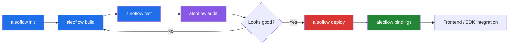
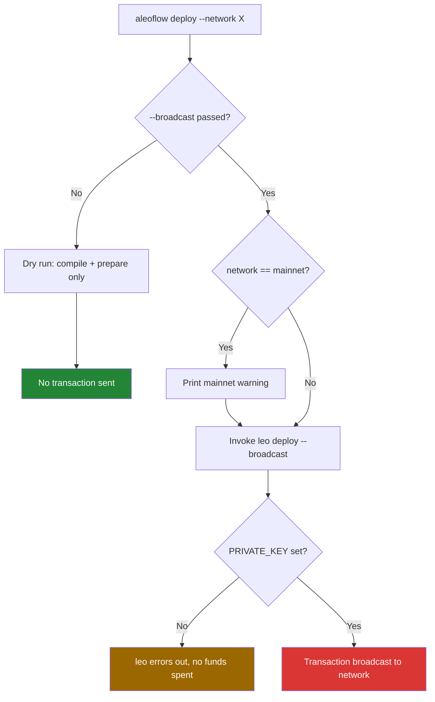

# AleoFlow

A single-binary developer CLI that wraps the Aleo toolchain (`leo` and
`snarkOS`) into one consistent workflow: scaffold, build, test,
audit, deploy, generate TypeScript bindings, manage accounts, query on-chain
state, and run diagnostics — all from one command.

Built for the **Aleo Hackathon 2026 — Infrastructure & Developer Tools
track**.

AleoFlow does not reimplement Leo's compiler or the Aleo network client.
It wraps the official `leo` CLI and adds the parts that are missing from
day-to-day developer workflow: project scaffolding with real templates, a
lightweight privacy linter, TypeScript client stub generation from a
compiled program's ABI, best-effort error translation for known failure
patterns, and environment diagnostics.

## Why

Aleo's official tooling (`leo`, `snarkOS`) is powerful but fragmented —
getting a new privacy-preserving program from idea to deployed contract
means juggling several separate tools and remembering their exact flags.
AleoFlow collapses that into one binary with one consistent interface,
similar in spirit to tools like `create-react-app` or `cargo` itself:
opinionated defaults, real templates, and no reinvention of the
underlying compiler or network logic.

## Prerequisites

- **Rust** (stable toolchain) — <https://rustup.rs>
- **Leo** — the Aleo compiler AleoFlow wraps:
  ```
  cargo install cargo-binstall
  cargo binstall leo-lang
  ```
  Verify with `leo --version`.
- **leo-fmt** — only required for the `fmt` command. Install from
  <https://github.com/AleoHQ/leo-fmt>.
- **snarkOS** — only required for the `devnet` and `records list` commands
  (local test network / record scanning). Install via
  `leo devnet --install` the first time you run `aleoflow devnet`.

## Install### 1. From source (always works)

Requires Rust (<https://rustup.rs>). Clone and install the CLI directly
from the repository:

```
git clone https://github.com/DiverseXL/aleoflow
cd aleoflow
cargo install --path .
```

Or build a release binary and run it directly:

```
cargo build --release
./target/release/aleoflow --help
```

The binary is fully portable — project templates are embedded into it at
compile time, so it works from any directory without needing the
`templates/` folder alongside it.

### 2. From GitHub Releases

If you don't have Rust installed, download a pre-built binary from the
[GitHub Releases](https://github.com/DiverseXL/aleoflow/releases/latest)
page and put it on your PATH. On Linux/macOS, run `chmod +x` on the
downloaded file if needed.

Select the binary corresponding to your platform:
- **Linux**: `aleoflow-linux-x86_64`
- **macOS (Apple Silicon)**: `aleoflow-macos-arm64`
- **Windows**: `aleoflow-windows-x86_64.exe`

### 3. From crates.io

AleoFlow is published on crates.io, so it can be installed with the
one-liner:

```
cargo install aleoflow
```

## Quick Start

```
aleoflow init my-app --template payment
cd my-app
aleoflow build
aleoflow test
aleoflow audit .
aleoflow run transfer 100u64
```

## Workflow



Each stage wraps a real underlying tool rather than reinventing it —
`build`/`test`/`deploy`/`devnet`/`run`/`execute`/`fmt`/`account`/`query` shell
out to the official `leo` binary; `audit` and `bindings` are AleoFlow-native
additions that fill gaps the official toolchain doesn't cover; `doctor`
checks the local development environment; `records list` shells out to
`snarkOS`.

### Deploy safety flow



This mirrors `leo deploy`'s own default behavior (dry-run unless
`--broadcast` is explicit) rather than layering a separate confirmation
system on top of it.

## Commands

AleoFlow provides 16 top-level commands. The section below covers each one.

### `aleoflow init <name> [--template <template>] [--workspace <members>]`

Scaffolds a new Aleo project from a built-in template. Templates:

- `payment` — basic private transfer
- `defi` — deposit / withdraw pair
- `ai-agent` — simple agent state record + inference stub
- `gamefi` — player state / score submission record
- `token` — fungible token following the community-standard `token.aleo` pattern (note: not an officially ratified ARC)

When `--template` is omitted, AleoFlow uses `aleo.toml`'s `default_template`
setting, or falls back to `payment`.

Project names containing hyphens are automatically sanitized to
underscores for the generated Aleo program ID (Aleo program identifiers
cannot contain hyphens), while the folder name stays exactly as typed.

```
aleoflow init my-voting-app --template defi
```

#### Workspace mode (`--workspace`)

Pass a comma-separated list of member names to scaffold a multi-package
workspace root instead of a single project. Creates a `workspace.json` file
at the root listing all members, then scaffolds each member as a separate
subdirectory with the same template.

```
aleoflow init my-mono --template payment --workspace token,governance,treasury
```

This produces:

```
my-mono/
  workspace.json          # {"members": ["token", "governance", "treasury"]}
  token/                  # scaffolded from payment template
  governance/             # scaffolded from payment template
  treasury/               # scaffolded from payment template
```

Use `aleoflow deploy --path my-mono --package <name>` or `--all` to deploy
workspace members (see deploy section).

### `aleoflow build [--path <path>] [--json-output[=<file>]]`

Wraps `leo build`. Compiles the Leo program at `path` (or the current
directory if omitted) into Aleo instructions.

```
aleoflow build --path my-app
```

### `aleoflow test [--path <path>] [--json-output[=<file>]]`

Wraps `leo test`.

```
aleoflow test --path my-app
```

### `aleoflow fmt [--path <path>]`

Wraps `leo fmt` to format your Leo source files using `leo-fmt`. Requires
`leo-fmt` on PATH (install from
<https://github.com/AleoHQ/leo-fmt>).

```
aleoflow fmt --path my-app
```

### `aleoflow run <name> [inputs...] [--path <path>] [--network <network>] [--endpoint <url>] [--json-output[=<file>]] [--private-key <key>]`

Locally executes a Leo transition or function in dry-run mode — compiles and
runs it against the AVM simulator without sending any on-chain transaction.

`<name>` defaults to `"main"` if omitted. Inputs are passed as raw Leo literal
strings (e.g. `1u64`, `aleo1...`, `true`).

```
aleoflow run transfer 100u64
aleoflow run main                                    # only if the program defines a `main` function
```

#### Best-effort error translation

When `leo run` fails with a known error pattern, AleoFlow prints an
additional friendly summary **after** leo's raw output, translating low-level
AVM register names back to the source-level parameter names it parsed from
your `.leo` file:

```
Error [ECLI0377045]: Failed to evaluate program: Stack evaluation failed:
Instruction (assert.neq r0 0u64;) at index 0 failed: 'assert.neq' failed:
'0u64' is equal to '0u64' (should not be equal)

[aleoflow] Assertion failed: expected 'amount' to not equal 0u64, but it was 0u64.
[aleoflow] This is a best-effort translation of the raw AVM error above
         -- always check the full output if this doesn't match what you expect.
```

> [!IMPORTANT]
> This is **best-effort** and pattern-based — it handles the confirmed
> error formats listed below. For any error that doesn't match a known
> pattern, AleoFlow prints nothing extra; leo's own raw output is always
> shown in full.
>
> **Currently translated patterns:**
> - Assertion failures (`assert.neq` / `assert.eq`): register mapped to source
>   parameter name via leo_param_names parser
> - `PRIVATE_KEY` missing from environment: suggests `aleoflow account new`
> - Insufficient balance for fee: recommends funding the account
> - Connection refused on endpoint: suggests checking the endpoint URL
> - Invalid/missing Leo project path: suggests using `--path`

### `aleoflow execute <name> [inputs...] [--broadcast] [--path <path>] [--network <network>] [--endpoint <url>] [--json-output[=<file>]] [--private-key <key>]`

Executes a Leo transition or function. Runs in **dry-run mode** by default
(no transaction sent) — pass `--broadcast` to actually submit the execution
transaction to the network.

```
aleoflow execute transfer 100u64 aleo1recipient...      # dry run
aleoflow execute transfer 100u64 aleo1recipient... --broadcast   # real tx
```

Executing on `mainnet` with `--broadcast` prints an explicit warning before
proceeding, matching the same safety convention as `deploy`.

Same best-effort error translation as `run` applies — see the run section
for details.

### `aleoflow audit <path>`

A heuristic static linter for Leo source files — **not** a formal verifier. Checks include:

1. **Sensitive-named record fields declared public**: Detects record fields with sensitive names (e.g., `password`, `secret`, `private_key`, `ssn`) declared as public.
2. **On-chain leaks via mapping writes**: Detects `Mapping::set` calls that write sensitive-named values to public on-chain mappings.
3. **The "finalize-leak" check**: A single-hop, shallow data-flow check that catches private record fields (either directly or via a single intermediate `let` binding) being passed into `finalize` or asynchronous function calls. This prevents private record fields from being leaked onto the public on-chain ledger, a documented Aleo security vulnerability (see [Aleo Program Security](https://blog.zksecurity.xyz/posts/aleo-program-security/)) that `leo build` itself does not catch.
   - *Note:* This check is single-hop/shallow and does not track multi-step reassignments, arithmetic transformations, or values passed through helper functions first.
4. **TODO/FIXME comments**: Identifies leftover `TODO` or `FIXME` comments as informational findings.

```
aleoflow audit ./my-app
```

### `aleoflow deploy --path <path> [--network <network>] [--broadcast] [--endpoint <url>] [--json-output[=<file>]] [--package <name> | --all] [--private-key <key>]`

Wraps `leo deploy`. Runs in **dry-run mode by default** — it compiles and
prepares the deployment but does not broadcast anything unless
`--broadcast` is explicitly passed. This mirrors `leo`'s own safety
default rather than re-implementing a separate confirmation flow.

Deploying to `mainnet` with `--broadcast` prints an explicit warning
before proceeding.

`--endpoint` overrides the target RPC endpoint (useful for pointing at a
local `leo devnet` node instead of the public testnet API, e.g. during
an outage on the public endpoint).

```
# Dry run — safe, does not deploy anything
aleoflow deploy --path my-app --network testnet

# Actually deploy to testnet
aleoflow deploy --path my-app --network testnet --broadcast

# Deploy against a local devnet instead of the public API
aleoflow deploy --path my-app --network testnet --broadcast --endpoint http://localhost:3030
```

Deployment requires a funded account. See **Deploying for real** below.

#### Workspace deployment

When `--path` points to a workspace root (a directory containing
`workspace.json`), deploy accepts workspace-specific flags:

```
# Deploy a single workspace member
aleoflow deploy --path my-mono --package token --network testnet --broadcast

# Deploy all workspace members sequentially
aleoflow deploy --path my-mono --all --network testnet --broadcast
```

Workspace mode requires either `--package <name>` or `--all`. Using neither
prints an error listing available members.

### `aleoflow devnet [--path <path>] [--network <network>] [--endpoint <url>] [--json-output[=<file>]]`

Wraps `leo devnet` to start a local Aleo development network. Requires
snarkOS; if it isn't installed, AleoFlow will tell you to run
`leo devnet --snarkos <path> --install` on the first run (snarkOS is not bundled
and must be built/installed separately).

```
aleoflow devnet --path my-app
```

Supports `--network` and `--endpoint` for connecting the devnet to a specific
network or RPC endpoint.

### `aleoflow bindings <path> [--output <file>] [--remote <program_id>]`

Generates TypeScript client stubs from a compiled program's ABI
(`build/<program_id>/abi.json`, produced by `leo build`). If the ABI
file doesn't exist yet, AleoFlow runs `leo build` automatically before
generating bindings, so this command works even on a fresh project.
Parameter names are pulled from the `.leo` source directly, since Leo's
ABI JSON does not currently preserve them. Output defaults to
`<path>/bindings/<program_name>.ts`.

Generates real, working `@provablehq/sdk` execution calls via
`buildExecutionTransaction`. It requires the caller to set the `PRIVATE_KEY`
and `ALEO_ENDPOINT` environment variables, and automatically handles
`initializeWasm()` under the hood. All execution functions return a
`{ success: true, txId } | { success: false, error }` result shape. Any
record-typed parameters are left as a marked `TODO` rather than guessing
at the structure conversion.

```
aleoflow bindings my-app
```

#### Remote bindings

Pass `--remote <program_id>` to generate bindings for a program that is
deployed on-chain, without needing a local Leo project. This fetches the
compiled program and its ABI from the network.

```
aleoflow bindings --remote credits.aleo --network testnet
```

### `aleoflow records list --view-key <key> --end <height> [--start <height>] [--endpoint <url>]`

Wraps `snarkos developer scan`.

> [!IMPORTANT]
> **LOCAL-ONLY FEATURE**: This command does **not** work against the public testnet API at all (the public API blocks this RPC method). It only works against a locally running snarkOS node, such as one started via `leo devnet`.

- `--view-key` (required): The view key cryptographically required to decrypt records (neither the private key nor address alone can be used).
- `--end` (required): The end block height to scan to (no default).
- `--start` (optional): The start block height to scan from (defaults to `0`).
- `--endpoint` (optional): The RPC endpoint to scan against (defaults to `http://localhost:3030`).

If snarkOS is not installed, AleoFlow will guide you to install it via `leo devnet --snarkos <path> --install`.

Example:
```
aleoflow records list --view-key AViewKey1... --end 1000
```

### `aleoflow doctor`

Diagnoses the local Aleo development environment and prints a summary of
pass/warn/fail checks. No arguments needed — just run it:

```
aleoflow doctor
```

**What it checks:**
1. **Rust toolchain** — `rustc` and `cargo` present and on PATH
2. **Windows-specific** — GNU vs MSVC toolchain, `dlltool`, `LIBCLANG_PATH`
3. **Leo** — the `leo` CLI is installed and reachable
4. **snarkOS** — present on PATH (warn-only; snarkOS is optional)
5. **leo-fmt** — present on PATH (warn-only; leo-fmt is optional)
6. **Environment variables** — `PRIVATE_KEY`, `NETWORK`, `ENDPOINT` set/unset
   (checks presence only; never prints or logs their values)
7. **Git repository** — whether the current directory is inside a git
   repository (WARN if not, based on a real incident where work was lost
   outside version control)
8. **Git remote** — if inside a git repo, whether a remote is configured
   (WARN if local-only/unbacked-up)

Each check shows a `[done]`, `[warning]`, or `[error]` status with an
actionable message when something is wrong. The summary line reports the
total pass/warn/fail count, and the command exits with a non-zero code if
any critical checks failed.

> [!NOTE]
> `doctor` checks tool availability and environment setup — it does not
> validate Leo project structure, verify on-chain connectivity, or test
> account balances. It is a quick environment sanity check, not a
> comprehensive system audit.

### `aleoflow account`

Manage Aleo accounts: generate, import, sign, verify, and decrypt. All
subcommands wrap the corresponding `leo account` functionality.

#### `aleoflow account new [--seed <n>] [--write] [--discreet] [--network <name>] [--endpoint <url>]`

Generate a new Aleo account. Optionally seed the RNG for reproducibility,
write the private key to `.env`, or print to an alternate screen for
security.

```
aleoflow account new
aleoflow account new --seed 42 --write --network testnet
```

#### `aleoflow account import [<private_key>] [--write] [--discreet] [--network <name>] [--endpoint <url>]`

Derive an Aleo account from an existing private key. If omitted, prompts
interactively.

```
aleoflow account import APrivateKey1...
aleoflow account import --write
```

#### `aleoflow account sign --message <aleo_value> [--private-key <key>] [--private-key-file <path>] [--raw]`

Sign a message (Aleo value) using your Aleo private key. Use `--raw` to
sign the message as raw bytes instead of Aleo literal parsing.

```
aleoflow account sign --message 1u64
aleoflow account sign --message "hello" --private-key APrivateKey1... --raw
```

#### `aleoflow account verify --address <addr> --signature <sig> --message <msg> [--raw]`

Verify a message signature against an Aleo address.

```
aleoflow account verify \
    --address aleo1... \
    --signature sign1... \
    --message 1u64
```

#### `aleoflow account decrypt --ciphertext <ctext> [-k <key>] [-f <key_file>]`

Decrypt a record ciphertext using your Aleo private key or view key.

```
aleoflow account decrypt --ciphertext record1... -k APrivateKey1...
```

### `aleoflow query`

Query Aleo network state. All subcommands wrap `leo query` and support
`--network`, `--endpoint`, and `--json-output`.

Default endpoint when none is specified:
`https://api.explorer.provable.com/v1`

```
aleoflow query block --latest
aleoflow query transaction at1...
aleoflow query program credits.aleo --mappings
aleoflow query stateroot
aleoflow query committee
```

#### `aleoflow query block [<id>] [--latest] [--latest-hash] [--latest-height] [--range <start> <end>] [--transactions] [--to-height] [--network <network>] [--endpoint <url>] [--json-output[=<file>]]`

Query a block by height, hash, or range (max 50 per range request). If no
block identifier is given, must use one of `--latest`, `--latest-hash`,
`--latest-height`, or `--range`.

```
aleoflow query block 1000
aleoflow query block --latest
aleoflow query block --latest-hash
aleoflow query block --range 100 150 --transactions
```

#### `aleoflow query transaction [<id>] [--confirmed] [--unconfirmed] [--from-io <id>] [--from-transition <id>] [--from-program <name>] [--network <network>] [--endpoint <url>] [--json-output[=<file>]]`

Query a transaction by ID, or filter by program IO, transition ID, or
program name. If no transaction ID is given, must use one of the `--from-*`
flags.

```
aleoflow query transaction at1...
aleoflow query transaction --from-program credits.aleo
```

#### `aleoflow query program <name> [--edition <n>] [--mappings] [--mapping-value <name> <key>] [--network <network>] [--endpoint <url>] [--json-output[=<file>]]`

Query a deployed program's structure or mapping values.

```
aleoflow query program credits.aleo
aleoflow query program credits.aleo --mappings
aleoflow query program credits.aleo --mapping-value account_map aleo1...
```

#### `aleoflow query stateroot [--network <network>] [--endpoint <url>] [--json-output[=<file>]]`

Query the current state root.

```
aleoflow query stateroot
```

#### `aleoflow query committee [--network <network>] [--endpoint <url>] [--json-output[=<file>]]`

Query the current committee information.

```
aleoflow query committee
```

### `aleoflow env [--network <network>] [--endpoint <url>]`

Preview the resolved configuration AleoFlow would use for a command,
without actually running anything. Shows each setting and where it came
from. This is useful for debugging configuration issues -- it directly
addresses endpoint-precedence bugs (invisible until a command fails) and
PRIVATE_KEY confusion (not knowing if it is actually set in the current
shell session).

```
aleoflow env
aleoflow env --profile mainnet
aleoflow env --network testnet --endpoint http://localhost:3030
```

**What it shows:**

- **Network** -- the resolved network name (testnet, mainnet, canary) and
  the source it came from (CLI `--network` flag > `--profile` >
  aleo.toml `default_network` > built-in default)
- **Endpoint** -- the resolved endpoint URL and its source
- **PRIVATE_KEY** -- whether the environment variable is set (yes/no
  only; never prints the value)
- **Profile** -- which named profile (if any) is active
- **Config** -- path to `aleo.toml` being read, or `none found (using
  built-in defaults)`

Accepts the same `--profile`, `--network`, and `--endpoint` flags as
other commands, so you can preview "what would happen if I ran X with
these flags" before actually running anything.

## Proof of deployment

AleoFlow has been used to deploy a real program to Aleo testnet:

- **Program:** `diag_test.aleo`
- **Transaction ID:** `at13ujqtwaj7vmyvjm6hewuk4wevp3x94lqrd3mywrr6jm4ml59yups7j4lts`
- **Explorer:** <https://explorer.aleo.org/transaction/at13ujqtwaj7vmyvjm6hewuk4wevp3x94lqrd3mywrr6jm4ml59yups7j4lts>

Deployed with:
```
aleoflow deploy --path diag-test --network testnet --broadcast
```

## Releases

AleoFlow is distributed through two channels, both currently at version
**0.1.1**:

- **crates.io** — install with `cargo install aleoflow`:
  <https://crates.io/crates/aleoflow>
- **GitHub Releases** — pre-built binaries for Linux, macOS (Apple Silicon),
  and Windows, built automatically for each `v*` tag:
  <https://github.com/DiverseXL/aleoflow/releases>

## Deploying for real

`leo deploy` (and therefore `aleoflow deploy --broadcast`) requires a
funded private key. To set one up:

```
leo account new
```

Save the printed private key, view key, and address somewhere safe. Then
get testnet credits -- `aleoflow faucet <ADDRESS>` opens the official
faucet in your browser with the address pre-printed and copy-ready
(see the [faucet section](#aleoflow-faucet-address) below):

<https://faucet.aleo.org/>

Set the key as an environment variable, or in a `.env` file in your
project root:

```
ENDPOINT=https://api.explorer.provable.com/v1
NETWORK=testnet
PRIVATE_KEY=<your private key>
```

Then:

```
aleoflow deploy --path my-app --network testnet --broadcast
```

**Note:** the public testnet API (`api.explorer.provable.com`) can
occasionally return connection timeouts (Cloudflare 522) or fail to
resolve the latest block height under load. This is an infrastructure
issue on Aleo's side, not a local configuration problem — if you hit
it, wait a few minutes and retry. As a fallback that removes the
dependency on the public API entirely, you can run a local devnet
(`leo devnet --snarkos ./snarkos-bin --install`, then
`leo devnet --path my-app --snarkos ./snarkos-bin`) and deploy against
it with `aleoflow deploy ... --endpoint http://localhost:3030`.

### `aleoflow faucet [address]`

Opens the official Aleo testnet faucet (https://faucet.aleo.org/) in
your default browser and prints the address in a copy-ready format, plus
fallback alternatives if the primary faucet is slow or unavailable.

The `address` argument is a positional, optional Aleo address. If
omitted, the command prints a clear error with the correct usage.

```
aleoflow faucet aleo1064wgu5z5relqrhk6lv2ngr5zw5mf8eyp9sf03eu8q00mkv8zursd34fkt
```

**What it does:**

- Prints the address on its own line for easy copying
- Opens https://faucet.aleo.org/ in your default browser (using
  `open` on macOS, `start` on Windows, `xdg-open` on Linux)
- Displays a guidance message explaining how to complete the faucet
  request
- Lists alternative faucets: the Discord `#faucet` channel's
  `/sendcredits` command (rate-limited to 50 credits/hour) and
  Stakely's faucet (requires captcha + verification tweet)

**What it does NOT do:**

This is an intentional convenience wrapper, not a bypass of anti-bot
protection. Aleo's faucets (official web form, Stakely with captcha +
tweet verification) are deliberately not fully automatable, and
AleoFlow does not attempt to circumvent that:

- Does not submit the faucet form automatically
- Does not solve captchas
- Does not interact with Discord's API
- Does not interact with Stakely's API

If opening the browser fails (no default browser, running headless,
etc.), AleoFlow prints the faucet URL so you can open it manually
instead of failing with an error.

No private key or sensitive data is involved -- this command only
handles a public Aleo address.

This command does not require a Leo project directory and works from
anywhere.

## `--json-output` and CI use

`build`, `test`, `deploy`, `devnet`, `run`, `execute`, and `query` all
support `--json-output`, forwarded directly to `leo`. This is intended
for scripting and CI pipelines rather than interactive use — passing it
suppresses the normal colored progress output in favor of a structured
JSON result file.

```
aleoflow build --path my-app --json-output
```

## Optional config: `aleo.toml`

AleoFlow will look for an `aleo.toml` file in the current directory and
use it to fill in flags you didn't pass explicitly. CLI flags always
take priority over the config file.

```toml
default_network = "testnet"
default_template = "payment"
```

- `default_template` — used by `init` when `--template` is omitted
- `default_network` — used by `deploy`, `devnet`, `run`, `execute`, and
  `query` commands when `--network` is omitted

If the file is missing, malformed, or simply not present, AleoFlow falls
back to its built-in defaults and continues normally — a broken or
absent `aleo.toml` never blocks the CLI.

### Named profiles (`[profiles.<name>]`)

Define named endpoint/network presets under `[profiles]` and reference them
with the `--profile` flag. This is useful when you switch between multiple
environments (e.g. local devnet vs. public testnet).

```toml
[profiles.local]
endpoint = "http://localhost:3030"
network = "testnet"

[profiles.mainnet]
endpoint = "https://api.explorer.provable.com/v1"
network = "mainnet"
```

```
aleoflow deploy --path my-app --profile local --broadcast
aleoflow run transfer 1u64 --profile mainnet
```

**Precedence order** (most to least specific):

1. **Explicit CLI flags** (`--network`, `--endpoint`)
2. **Named profile** (`--profile <name>` from `aleo.toml`'s
   `[profiles.<name>]` section)
3. **Config file defaults** (`default_network` at the top level of
   `aleo.toml`)
4. **Built-in hardcoded defaults** (e.g. Testnet for deploy)

If the profile name does not exist, AleoFlow prints a clear error listing
all available profiles.

Profiles are available on: `deploy`, `devnet`, `run`, `execute`, `query`,
`records list`, and `env`.

> [!IMPORTANT]
> Never store private keys in `aleo.toml`. Use `.env` files or shell
> environment variables for secrets.

## Quiet mode

Every command accepts a global `-q` / `--quiet` flag that suppresses
`[info]` status messages, useful when combined with `--json-output` for
scripting or CI:

```
aleoflow build --path my-app --quiet --json-output
```

`[warning]`, `[done]`, `[error]`, and audit findings are never
suppressed — only informational status lines are silenced.

## What AleoFlow does not do

- It does not re-implement Leo's compiler, the ZK proving system, or
  snarkOS's networking logic — all of that is handled by the official
  `leo` and `snarkOS` binaries, which AleoFlow wraps.
- `audit` is a heuristic static linter and not a formal verifier; its
  data-flow checks are shallow/single-hop and do not replace a
  comprehensive, manual security audit.
- `bindings` leaves complex record-typed parameter conversions as marked
  `TODO`s rather than automatically generating conversion logic for them.
- `run` and `execute` error translation is best-effort and
  pattern-based — it handles only the confirmed error formats listed in
  the run section. Unrecognized errors pass through unchanged (leo's raw
  output is always shown in full). The translation is not a general-purpose
  debugger and does not provide stack traces, register state dumps, or
  program execution traces.
- `doctor` checks tool availability and environment setup only — it does
  not validate project structure, verify on-chain connectivity, or test
  account balances.
- `records list` does **not** work against the public testnet API (that
  endpoint blocks the required RPC method). It requires a locally running
  snarkOS node.
- `fmt` requires `leo-fmt` to be installed separately (not bundled with
  AleoFlow). Run `aleoflow doctor` to check if it is available.
- `faucet` does not submit the faucet form or bypass captcha/verification
  requirements -- it only opens the browser and prints the address together
  with guidance. Aleo's faucets are deliberately bot-resistant, and
  AleoFlow does not attempt to automate around those protections.

## License

This project is licensed under the MIT License - see the [LICENSE](LICENSE) file for details.
